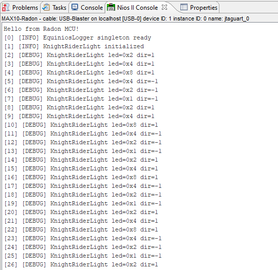

# Equinios

A lightweight logging library for embedded systems (Nios II / bare-metal), written in C.

The project provides a ring-buffer-based queue, log-level filtering, timestamps, and periodic buffer flushing via `log_process()`.

## Key Features

- log levels: `CRITICAL`, `ERROR`, `WARNING`, `INFO`, `DEBUG`, `TRACE`,
- convenience logging macros: `LOGC`, `LOGE`, `LOGW`, `LOGI`, `LOGD`, `LOGT`,
- configurable timestamp provider (`log_set_timestamp_provider`),
- dropped-line counter for ring buffer overflow,
- static library build output: `libEquiniosLogger.a`.

## Repository Structure

- `include/` - public API headers,
- `src/` - implementation,
- `api/` - umbrella application header (`equinios.hpp`),
- `examples/NiosLoggerDemo/` - minimal Nios II usage example,
- `Makefile` - library build script.

## Public API

Main C header:

- `include/equinios.h`

Exposed functions:

- `log_set_level(...)`
- `log_set_process_every_n_calls(...)`
- `log_set_timestamp_provider(...)`
- `log_get_dropped_lines()`
- `log_reset_dropped_lines()`
- `log_write(...)`
- `log_process()`

## Quick Start (Library)

Required tools:

- `make`,
- Nios II toolchain in PATH (default prefix: `nios2-elf-`).

## Toolchain Requirements

- Intel Quartus Prime Lite 18.1 (or compatible with this project)
- Nios II EDS / Nios II SBT for Eclipse
- Device support for MAX 10

## Important

- Build software from the Nios II Command Shell or Nios II Eclipse environment.
- Running plain system shells without Nios II environment may fail due to missing tools such as `make`, `nios2-elf-gcc`, and `nios2-download` in PATH.

If Eclipse reports "Program make not found in PATH", you can set PATH inside Eclipse:

1. Open `Window -> Preferences -> C/C++ -> Build -> Environment`
2. Add a variable:
	- Name: `PATH`
	- Value: `C:\intelfpga_lite\18.1\nios2eds\bin\gnu\H-x86_64-mingw32\bin;C:\intelfpga_lite\18.1\nios2eds\bin\gnu\H-x86_64-mingw32\bin\utils;C:\intelfpga_lite\18.1\quartus\bin64\cygwin\bin;${PATH}`
3. Apply and close Preferences.
4. Restart Eclipse.

Build the library:

```bash
make
```

Clean build artifacts:

```bash
make clean
```

Build output:

- `libEquiniosLogger.a`

## Application Example

The demo is located in:

- `examples/NiosLoggerDemo/`

Run instructions and hardware requirements are described in:

- `examples/NiosLoggerDemo/README.md`

## Runtime Output Example

Nios II console output captured while running the demo:



## License

BSD 3-Clause - see `LICENSE` for details.
